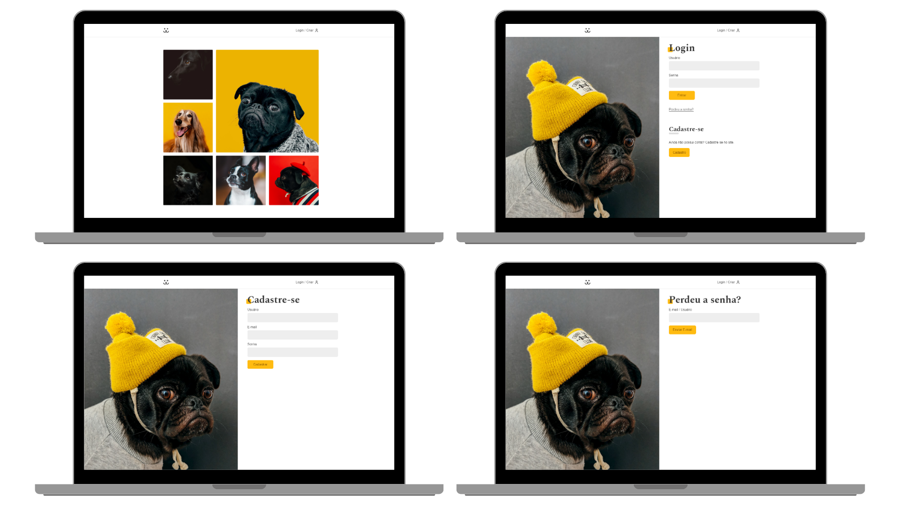
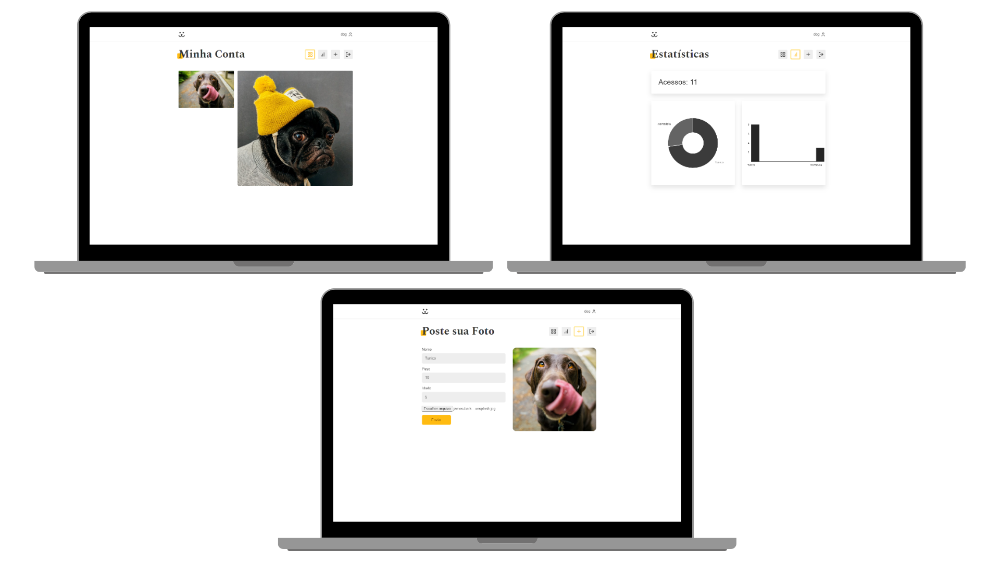

<h1 align="center">Dogs 🐶</h1>

<div align="center">
  A social network for dogs.
</div>

<!-- TABLE OF CONTENTS -->

## Table of Contents

- [Screens](#screens)
- [Built With](#built-with)
- [Features](#features)
- [How to use](#how-to-use)
- [Contact](#contact)

<!-- SCREENS -->

## Screens




<!-- BUILD WITH -->

## Built With

- [React](https://reactjs.org/)
- [React Router](https://reactrouter.com/en/main)
- [JavaScript](https://javascript.info/)
- [CSS Modules](https://github.com/css-modules/css-modules)
- [Vite](https://vitejs.dev/)
- [Lucide Icons](https://lucide.dev/)

<!-- FEATURES -->

## Features

- Photo feed view
- Register with username, email and password
- Login
- Logout
- Password recovery
- Post photo with dog's name, weight, age and photo
- Publication statistics

<!-- HOW TO USE -->

## How To Use

To clone and run this application, you'll need [Git](https://git-scm.com) and [Node.js](https://nodejs.org/en/download/) (which comes with [npm](http://npmjs.com)) installed on your computer. From your command line:

```bash
# Clone this repository
$ git clone https://github.com/joaoliveirapb/dogs.git

# Install dependencies
$ npm install

# Run the app
$ npm run dev
```

<!-- CONTACT -->

## Contact

- E-mail [joaoliveira.batista1@gmail.com](mailto:joaoliveira.batista1@gmail.com)
- LinkedIn [João Oliveira](https://www.linkedin.com/in/joao-oliveira-preto-batista/)
- GitHub [@joaoliveirapb](https://github.com/joaoliveirapb)
